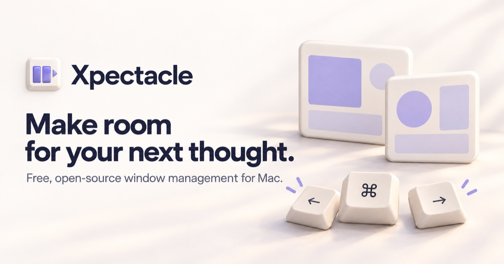

# Xpectacle

**[Visit the website](https://xpectacle.wonkytonks.chatgpt.site)** · [Download for Mac](#download-for-mac) · [Get help](docs/SUPPORT.md)

A free, open-source window manager for Mac, carrying forward the spirit of
[Spectacle](https://github.com/eczarny/spectacle). Arrange windows from your
keyboard, snap them to screen edges, and save arrangements for later.

## Download for Mac

**[Download Xpectacle 2.0.3](https://github.com/lammworks/Xpectacle/releases/download/v2.0.3/Xpectacle-2.0.3.dmg)**
· [Release notes and checksum](https://github.com/lammworks/Xpectacle/releases/tag/v2.0.3)
· [All releases](https://github.com/lammworks/Xpectacle/releases)

- Requires **macOS 14 or newer**.
- Includes native **Apple Silicon and Intel** builds in one app.
- Version 2.0.3 is **Developer ID signed and Apple notarized**, with notarization
  tickets attached to the app and DMG.
- This is a **compatibility preview**. See the release notes for verification
  results and remaining manual checks; notarization does not guarantee every
  window or display setup will work.

## Get started

1. Open the DMG and drag **Xpectacle** to **Applications**. Quit any older copy
   before replacing it, then open the copy in Applications.
2. Click **Open** if macOS asks you to confirm the Internet download. This is
   normal for the first launch of a signed, notarized download.
3. Use Xpectacle's menu-bar icon to open **Settings → Permissions**, then grant
   access in System Settings. The pane is called **Accessibility**, or **Device
   Control and Data Access** on macOS 27 Golden Gate.
4. Focus a window and try **⌥⌘←** to put it on the left, or **⌥⌘→** for the right.

Xpectacle needs Accessibility permission to control other apps' windows. It does
not request Screen Recording or Apple Events permission. If the switch is on but
the app still reports **Access required**, follow the
[permission recovery steps](docs/SUPPORT.md#access-is-required-even-though-the-switch-is-on).

## Make room for your work

- **Keyboard shortcuts:** move to halves, corners, and thirds; center or maximize
  a window; move between displays; undo and redo window moves.
- **Edge snapping:** drag a window toward an edge and wait for the preview before
  releasing. Adjust the delay or turn snapping off in Settings.
- **Saved layouts:** capture an arrangement and apply it to matching, already-open
  windows. Xpectacle does not launch apps or reopen documents for a layout.
- **Your preferences:** customize shortcuts, exclude apps from individual window
  actions and edge snapping, and choose whether Xpectacle launches at login.

### A few useful shortcuts

| Action | Default shortcut |
| --- | --- |
| Cycle left / right: ½ → ⅔ → ⅓ | ⌥⌘← / ⌥⌘→ |
| Top / bottom half | ⌥⌘↑ / ⌥⌘↓ |
| Center | ⌥⌘C |
| Maximize within the usable screen area | ⌥⌘F |
| Next horizontal third | ⌃⌥→ |
| Next / previous display | ⌃⌥⌘→ / ⌃⌥⌘← |
| Undo / redo window move | ⌥⌘Z / ⇧⌥⌘Z |

⌘ Command · ⌥ Option · ⌃ Control · ⇧ Shift. Imported Spectacle shortcuts and your
own customizations take precedence; **Settings → Shortcuts** shows your bindings.
The app's “Fullscreen” action maximizes a window without creating a macOS
full-screen Space. Some apps enforce minimum window sizes or do not expose
movable windows through Accessibility.

Repeat **⌥⌘←** or **⌥⌘→** to cycle a window through half, two thirds, and one
third of the screen. Each window keeps its own cycle. Put your main window in
two thirds and another in the remaining third, or use **⌥⌘C** to center a window
without changing its size. Drag-to-edge snapping still uses half width.

## Free, local, and open source

No account, subscription, or AI service is needed to use Xpectacle. Window control
runs on your Mac. Settings and saved layouts are stored locally; **captured layouts
can include window titles**, so review them before sharing a settings file.
Read [Privacy](docs/PRIVACY.md) for exactly what the app reads and stores.

Updates are **manual**. “Check for Updates…” opens GitHub Releases in your browser;
it does not download or install an update. See [Support](docs/SUPPORT.md) for
installation, permissions, and troubleshooting.

## Thank you, Spectacle

Spectacle, created by **Eric Czarny and its contributors**, made keyboard-driven
window management feel natural. Xpectacle began with a longtime user's wish to
keep that familiar workflow available on modern Macs, using Swift and SwiftUI
with development help from Claude and ChatGPT.

This is an **independent descendant**, not an official Spectacle release. It is
not affiliated with or endorsed by Eric Czarny or the original Spectacle project.
Their work, source history, and MIT notices remain part of this repository.
See [Credits](docs/CREDITS.md) and the [MIT license](LICENSE.md).

## Contribute

Bug reports, documentation, compatibility testing, and focused pull requests are
welcome. Start with [Contributing](CONTRIBUTING.md).

The maintained Swift app lives in [`Xpectacle2026/`](Xpectacle2026/).
The older Objective-C project and [legacy documentation](docs/LEGACY-SPECTACLE.md)
are retained for history; they are not the current app's build instructions.
